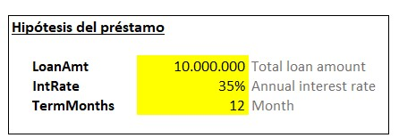
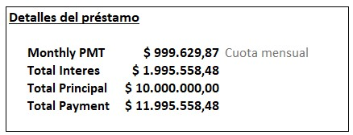
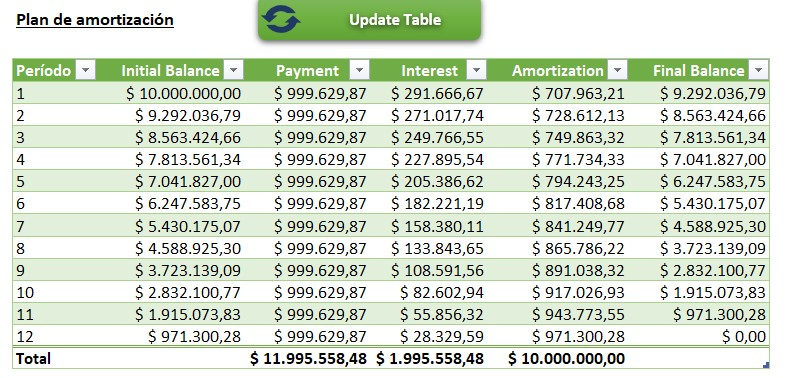
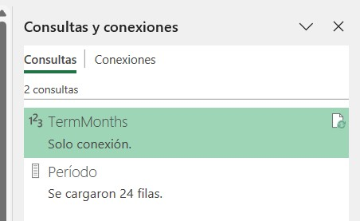

# 📊 Amortización de Préstamos en Excel

  

Este proyecto permite generar un cuadro de amortización siguiendo el **sistema francés**, utilizando **VBA** para automatizar la tabla y **Power Query** para mantener un rango dinámico de datos. Ideal para quienes buscan aplicar soluciones financieras en Excel de forma profesional y automatizada.

---

## 📌 Funcionalidades principales

- Cálculo de cuotas fijas mensuales.
- Resumen detallado del préstamo: intereses, principal y total pagado.
- Tabla de amortización dinámica actualizable con un botón.
- Parámetros editables resaltados en amarillo para facilitar el ingreso de datos.

---

## 🧰 Tecnologías utilizadas

- Microsoft Excel
- VBA (Visual Basic for Applications)
- Power Query

---

## 🖼️ Capturas

### 🟡 Hipótesis del préstamo

### 📄 Detalles del préstamo

### 📆 Plan de amortización

---

## ▶️ Cómo usarlo

1. Abrí el archivo `.xlsm` en Excel.
2. Completá los campos amarillos con los datos de tu préstamo.
3. Hacé clic en **"Update table"** para refrescar la tabla automáticamente.
4. Explorá el resultado en la sección “Plan de amortización”.

> 💡 Tip: Podés revisar la conexión de Power Query en **Datos → Consultas y conexiones**.

---
## 🧠 Autor

**Mauro Caruso**  
📍 Buenos Aires, Argentina  
🔗 [LinkedIn](https://www.linkedin.com/in/maurocaruso/) | [GitHub](https://github.com/carusomn)

---
